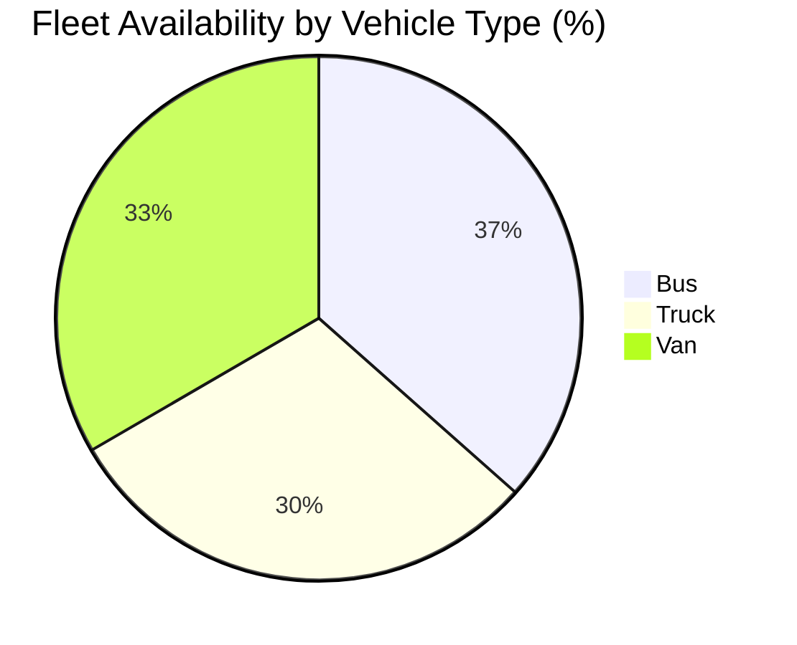

# Analytics

Base endpoints:
- Analytics: `GET /api/fleet/analytics/` (dynamic KPI metrics)
- Dashboard summary (related): `GET /api/fleet/dashboard/summary/`

Permissions:
- `/api/fleet/analytics/`: Admin only (requires authenticated admin)
- `/api/fleet/dashboard/summary/`: Any authenticated user

Query params (analytics):
- `date_range`: `today|10days|30days|90days` (shortcut)
- `start_date`, `end_date`: `YYYY-MM-DD` (used if `date_range` is not provided)
- `metrics`: comma‑separated list of metrics to compute; if omitted, returns all
- `group_by`: currently supports `vehicle_type` (affects `fleet_availability` only)
- `vehicle_type`: filter by vehicle type id
- `vehicle_id`: filter by vehicle id
- `driver_id`: filter by driver id

Available metrics (exact backend behavior):
- `fleet_availability`: percentage of vehicles not in `maintenance`/`retired`. With `group_by=vehicle_type`, returns a map of `{ vehicle_type_name: pct }`; otherwise a single percentage number.
- `average_downtime`: average completed maintenance downtime in hours over the filtered window. Uses `MaintenanceRecord(start_date..end_date)` and only `status='completed'` with an `end_date`.
- `accident_rate`: total accidents per km = `sum(DriverPerformance.number_of_accidents) / sum(distance_covered_km)` (0 if distance is 0).
- `average_eco_score`: average of `DriverPerformance.eco_score` over the range.
- `total_maintenance_cost`: sum of `MaintenanceRecord.cost` as a string (decimal serialized as JSON string).
- `active_alerts`: count of unresolved `Alert` records.
- `geofence_breaches`: count of `Alert` with `alert_type='geofence'`.
- `total_distance`: sum of `Trip.distance_travelled_km` for `status='completed'`.
- `average_speed`: average of `DriverPerformance.average_speed_kph`.

Notes and edge cases
- Unknown metrics are ignored (not an error). Missing data yields zeros.
- `fleet_availability` is the only metric affected by `group_by`.
- `total_maintenance_cost` is returned as a string in JSON (example: "3450.50").

Examples
- All metrics for last 30 days:
  `GET /api/fleet/analytics/?date_range=30days`

- Specific metrics and custom range:
  `GET /api/fleet/analytics/?metrics=average_eco_score,accident_rate&start_date=2023-01-01&end_date=2023-01-31`

- Grouped availability by vehicle type:
  `GET /api/fleet/analytics/?metrics=fleet_availability&group_by=vehicle_type`

Sample responses

All metrics (truncated):
```
{
  "fleet_availability": 82.5,
  "average_downtime": 6.75,
  "accident_rate": 0.0031,
  "average_eco_score": 87.2,
  "total_maintenance_cost": "3450.50",
  "active_alerts": 4,
  "geofence_breaches": 1,
  "total_distance": 12450.7,
  "average_speed": 52.9
}
```

Grouped availability:
```
{
  "fleet_availability": {
    "Bus": 91.2,
    "Truck": 75.0,
    "Van": 83.3
  }
}
```

Dropdown sources (filters)
- `vehicle_type` → `GET /api/fleet/vehicle-types/` (use `id` as value; show `name`)
- `vehicle` → `GET /api/fleet/vehicles/` (search client‑side)
- `driver` → `GET /api/fleet/drivers/` (search client‑side)

Flowchart (ASCII) — Single Source

Use this block as the frontend‑accurate wireframe. It embeds the layout and the example graphs. Power KPI cards with `/api/fleet/analytics/`; build trends from domain endpoints as noted below.

```
┌─────────────────────────────────────────────────────────────────────────────┐
│ HEADER: Analytics                                     [Export ▾ (future)]   │
├─────────────────────────────────────────────────────────────────────────────┤
│ FILTERS: [Range ▾ today|10d|30d|90d] [Start] [End] [Vehicle Type] [Vehicle] │
│          [Driver] [Metrics (multi‑select)] [Group by ▾ vehicle_type] (Apply)│
├─────────────────────────────────────────────────────────────────────────────┤
│ KPI CARDS                                                                   │
│ ┌────────────────┐ ┌────────────────┐ ┌────────────────┐ ┌────────────────┐ │
│ │ Availability % │ │ Avg Downtime h │ │ Accident / km  │ │ Avg Eco Score  │ │
│ │     82.5%      │ │     6.8 h      │ │     0.0031     │ │      87.2      │ │
│ └────────────────┘ └────────────────┘ └────────────────┘ └────────────────┘ │
│ ┌────────────────┐ ┌────────────────┐ ┌────────────────┐ ┌────────────────┐ │
│ │ Maint. Cost    │ │ Active Alerts  │ │ Geofence       │ │ Total Distance │ │
│ │   ₹ 3,450.50   │ │       4        │ │   Breaches: 1  │ │     12,450 km  │ │
│ └────────────────┘ └────────────────┘ └────────────────┘ └────────────────┘ │
├─────────────────────────────────────────────────────────────────────────────┤
│ CHART ROW A                                                                 │
│ KPI Snapshot (Bar)                         Availability by Vehicle Type (%) │
│ Active Alerts      |████                | 4       Bus     |██████████████  | 91│
│ Geofence Breaches  |█                   | 1       Truck   |██████████      | 75│
│ Total Distance km  |███████████████     | 12450  Van     |████████████    | 83│
│ Avg Speed kph      |████████            | 53                                                  │
├─────────────────────────────────────────────────────────────────────────────┤
│ CHART ROW B                                                                 │
│ Downtime vs Eco Score (Dual Axis)                                           │
│ Hours (bar):     |███████| 6.8 h                                           │
│ Eco Score (line): .......*............... (scale 0–100)                     │
├─────────────────────────────────────────────────────────────────────────────┤
│ CHART ROW C (Trends from domain endpoints; aggregated client‑side)          │
│ Alerts per Day (Stacked)                                                     │
│ HIGH     : ██   █    ██     █                                               │
│ MED+LOW  : █████ ███ ███  █████                                             │
│            D1   D2   D3   D4   D5   D6   D7                                 │
│ Distance per Day (Line)                                                      │
│ 12k km |            __/\__                                                  │
│  9k km |      __/\_/      \__                                              │
│  6k km | __/\_/               \__                                          │
│  3k km |/                                                                   │
│         D1  D2  D3  D4  D5  D6  D7                                          │
└─────────────────────────────────────────────────────────────────────────────┘
```

Data calls
- KPIs: `GET /api/fleet/analytics/` with the selected filters
- Optional: `GET /api/fleet/driver-performance/` for deeper driver KPIs
- Optional: `GET /api/fleet/vehicle-performance/` for deeper vehicle KPIs
- Related summary: `GET /api/fleet/dashboard/summary/?date_range=30days`

Backend references
- Routes: `fleet/urls.py:62` (`/api/fleet/analytics/`), `fleet/urls.py:64` (`/api/fleet/dashboard/summary/`)
- View: `fleet/views.py:1797` (`DynamicAnalyticsView`), `fleet/views.py:1975` (`DashboardSummaryView`)
- Dependent models: `fleet/models.py:282` (`Vehicle`), `fleet/models.py:611` (`MaintenanceRecord`),
  `fleet/models.py:827` (`Alert`), `fleet/models.py:902` (`Trip`), `fleet/models.py:1107` (`DriverPerformance`)

## Charts & Graphs (Examples)

Notes
- The analytics endpoint returns KPIs (not time series). Use these for summary cards, gauges, and grouped pies. For trend charts, fetch from domain endpoints (e.g., trips, alerts) and aggregate client‑side.
- Mermaid is supported for simple diagrams in docs; pie charts work reliably. For production UI, use Chart.js or ECharts.

Mermaid — Availability by Vehicle Type

1) Call: `GET /api/fleet/analytics/?metrics=fleet_availability&group_by=vehicle_type`
2) Render pie from the returned map `{ type_name: pct }`.



Chart.js — KPI Overview (Bars)

Use a single analytics response to build a compact KPI bar chart.

```
// data = response from GET /api/fleet/analytics/?date_range=30days
const labels = ["Active Alerts", "Geofence Breaches", "Total Distance (km)", "Avg Speed (kph)"];
const values = [data.active_alerts, data.geofence_breaches, data.total_distance, data.average_speed];

new Chart(ctx, {
  type: 'bar',
  data: {
    labels,
    datasets: [{ label: '30‑day KPIs', data: values, backgroundColor: '#4f46e5' }]
  },
  options: { responsive: true, plugins: { legend: { display: false } } }
});
```

ECharts — Downtime vs Eco Score (Dual Axis)

```
// data = response from GET /api/fleet/analytics/?date_range=30days&metrics=average_downtime,average_eco_score
const option = {
  tooltip: { trigger: 'axis' },
  legend: { data: ['Avg Downtime (h)', 'Avg Eco Score'] },
  xAxis: { type: 'category', data: ['Last 30d'] },
  yAxis: [
    { type: 'value', name: 'Hours' },
    { type: 'value', name: 'Score', min: 0, max: 100, position: 'right' }
  ],
  series: [
    { name: 'Avg Downtime (h)', type: 'bar', data: [data.average_downtime] },
    { name: 'Avg Eco Score', type: 'line', yAxisIndex: 1, data: [data.average_eco_score] }
  ]
};
chart.setOption(option);
```

Client‑side aggregation patterns (for trends)
- Alerts per day (stacked area): GET `/api/fleet/alerts/?created_at__gte=...&created_at__lte=...` → group by `date(created_at)` and `severity` client‑side.
- Distance per day: GET completed trips in range (`/api/fleet/trips/?status=completed&actual_end_time__date__gte=...`) → sum `distance_travelled_km` per date.
- Maintenance cost per month: GET `/api/fleet/maintenance-records/?status=completed&end_date__gte=...` → sum `cost` by month.

UI pairing suggestions
- Use the KPI cards for instantaneous metrics from `/api/fleet/analytics/`.
- Add breakdown bar/pie only when `group_by` is used (e.g., availability by type).
- For trends, keep y‑axis units explicit (km, kph, hours, count). Ensure consistent date buckets (UTC vs local) and zero‑fill missing days.

## (Removed) Duplicated Wireframes

To avoid confusion, older separate flowchart/wireframe blocks were removed. The single flowchart above is the authoritative design.
